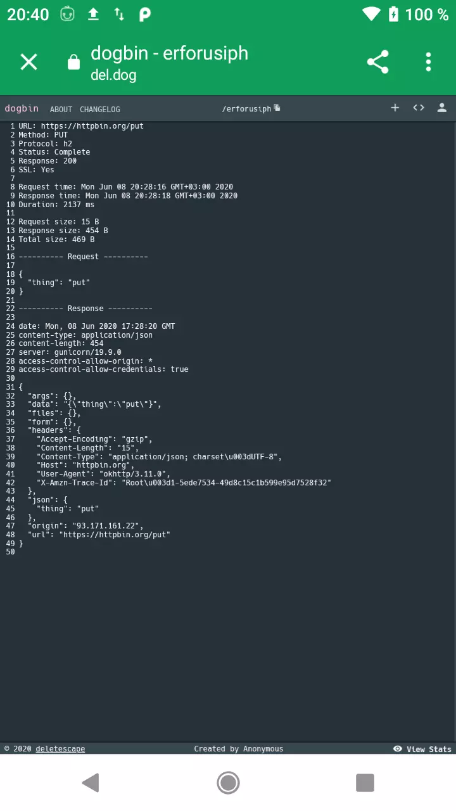

Change Log
==========

Version 1.2.6 *(2022-02-21)*
----------------------------

* Fix crash for Android 12

Version 1.2.5 *(2021-11-26)*
----------------------------

* Share as link (with [pastebin](https://pastebin.com/))

Version 1.2.4 *(2021-06-30)*
----------------------------

* Fix: display json null values
* Share as link (with [katbin](https://katb.in/))

Version 1.2.3 *(2020-06-08)*
----------------------------

* Fix: UI change for every database change.
 * Feature: Share as link (with [dogbin](https://del.dog/about.md))
 

Version 1.1.0 *(2017-08-06)*
----------------------------

 * Fix: Supports apps targeting Android O (API 26).

Version 1.0.4 *(2017-02-22)*
----------------------------

 * New: Displays uncompressed gzip encoded request/response bodies when used as a network interceptor.

Version 1.0.3 *(2017-02-14)*
----------------------------

 * New: Adds a maximum content length threshold, beyond which bodies are truncated.
 * New: Adds a data retention length property and cleanup task.
 * New: Adds a clear action to the notification.
 * Fix: Mitigates against CursorWindow blowout when transactions are large.

Version 1.0.2 *(2017-02-10)*
----------------------------

 * Fix: Added Proguard rule for compat SearchView.
 * Fix: Null search query displaying invalid results.

Version 1.0.1 *(2017-02-09)*
----------------------------

 * New: Adds a search action which filters on request path or response code.
 * New: Adds a transaction count to the notification.
 * Fix: Limits the size of the static transaction buffer correctly.

Version 1.0.0 *(2017-02-07)*
----------------------------

Initial release.